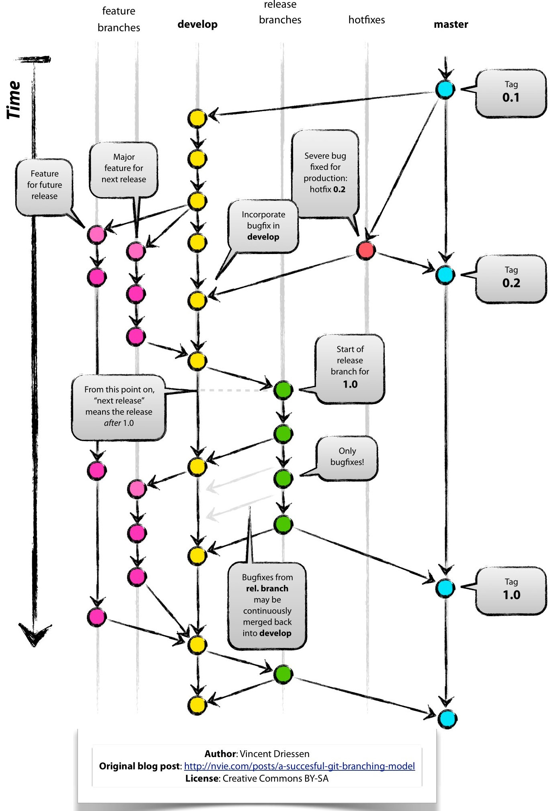

<h1 style="text-align:center">
    <b>GIT FLOW - Git Branching Model</b>
</h1>


<br>
<br>
<hr>
<br>
<br>


# <center>**INTRODUCTION**</center>

- ## **WHY TO FOLLOW A GIT FLOW**
<p style="text-align:justify">
    Anyone who uses Git as a version control tool for their software will have seen the various ways of controlling repository branches. It's common for people to use just one <i>branch</i> to make <i>commits</i> in personal projects, which isn't wrong, because when you're working alone it's easier to control everything in just one branch.
</p>
<p style="text-align:justify">
    However, the scenario becomes totally different and more complex when we are working with more contributors on a project.
</p>
<pre>
    In any real project, it is extremely important to have total control of what is being produced by a team of developers, where many things are being done at the <b>same time</b>, such as: implementing new features, correcting faults, releasing versions, etc. And this is precisely where Git Flow comes in to help us, facilitating the shared development of code with developers.
</pre>

<br>

- ## **WHICH MODEL WE WILL USE**
<p style="text-align:justify">
    Published in 2010 by Dutch software engineer Vincent Driessen, the aim of the <i>Git Branching Model</i> was to improve the organization of <i>branches</i> within repositories and thus streamline the process of developing new features, bug fixes and version releases.
</p>


<br>
<br>
<hr>
<br>
<br>


# <center>**GIT FLOW**</center>
<div style="text-align:center">
    
    <br>
    <p><b><i>Practical image of the model workflow</i></b></p>
</div>

<br>

- ## **MAIN BRANCHES**
<p style="text-align:justify">
    The repository contains two main <i>branches</i> with an 'infinite lifetime', <code>main</code> and <code>develop</code>. When the source code in the <code>develop</code> <i>branch</i> reaches a stable point and is ready for a new <i>release</i>, all changes should be merged back into <code>main</code> and then given a tag with a version number.
</p>
<p style="text-align:justify">
    Still, the main <i>branchs</i> <b>don't</b> receive <i>commits</i> directly! Only <i>merges</i> and <i>Pull Requests</i>.
</p>

<br>

### `main`
<p style="text-align:justify">
    We consider <code>origin/master</code> to be the main <i>branch</i> where the HEAD source code always reflects a production-ready state.
</p>

<br>
    
### `develop`
<p style="text-align:justify">
    We consider <code>origin/develop</code> to be the main <i>branch</i> where the HEAD source code always reflects a state with the latest development changes delivered for the next <i>release</i>.
</p>

<br>

- ## **AUXILIARY BRANCHES**
<p style="text-align:justify">
    This development model uses a variety of support <i>branches</i> to help parallel development between team members, facilitate <i>features</i> tracking, prepare production <i>releases</i> and help quickly resolve production problems in real time. Unlike the main <i>branches</i>, these <i>branches</i> always have a limited lifespan.
</p>
<p style="text-align:justify">
    These <i>branches</i> receive <i>commits</i> direclty.
</p>

<br>

### `feature`
```
- Parent Branch: develop
- Branch to receive the merge: develop
- Name branch pattern: feat-{feature name}
```
<p style="text-align:justify">
    <code>Feature branches</code> are used to develop new <i>features</i> for the next version or for a distant future version. When starting the development of a <i>feature</i>, the target version in which this functionality will be incorporated may be unknown at that time. The essence of a <i>feature branch</i> is that it exists while the <i>feature</i> is in development, but will eventually be merged back into <code>develop</code> (to definitively add the new <i>feature</i> to the next version) or discarded (in the case of an unsuccessful experiment).
</p>

<br>

### `release`
```
- Parent Branch: develop
- Branch to receive the merge: main e develop
- Name branch pattern: release-{version}
```
<p style="text-align:justify">
    <code>Release branches</code> support the preparation of a new production <i>release</i>. Permitem que se ponham os pontos nos "i's" e se cruzem os "t's" de última hora. In addition, they allow small <i>bug</i> fixes and the preparation of metadata for a <i>release</i> (version number, <i>build</i> dates, etc.). By doing all this work on a <code>release branch</code>, the <code>develop</code> is free to receive <i>features</i> for the next major <i>release</i>.
</p>
<p style="text-align:justify">
    The key moment to branch a new release from <code>develop</code> is when develop (almost) reflects the desired state of the new <i>release</i>. At least all the <i>features</i> that are targeted at the version to be built should be merged into <code>develop</code> at this point. All <i>features</i> targeted at future releases cannot - they have to wait until the <code>release branch</code> is branched.
</p>
<p style="text-align:justify">
    It is exactly at the start of a <code>release branch</code> that the next release receives a version number. Up to this point, the <code>develop</code> reflects the changes for the "next <i>release</i>", but it is not clear whether this "next <i>release</i>" will eventually become 0.3 or 1.0, until the <code>release branch</code> is started. This decision is made at the start of the <code>release branch</code> and is driven by the project's rules on increasing the number of versions.
</p>

<br>

### `hotfix`
```
- Parent branch: main
- Branch to receive the merge: main e develop
- Name branch pattern: hotfix-{fix name}
```
<p style="text-align:justify">
    <code>Hotfix branches</code> are very similar to <code>release branches</code> in that they are also intended to prepare a new production <i>release</i>, albeit unplanned.They arise from the need to act immediately on an undesired state of an active production release. When a critical <i>bug</i> in a production release has to be resolved immediately, a <code>hotfix branch</code> can be branched from the corresponding tag in the <code>main</code> that marks the production release.
</p>
<p style="text-align:justify">
    The essence is that the work of the team members in <code>develop</code> can continue, while someone else is preparing a quick production fix.
</p>

<br>

- ## **COMMITS**
<p style="text-align:justify">
    Commits message patterns.
</p>

### Types
- Created: when creating new functions, features, components, etc. ...
- Updated: when updating new functions, features, components, etc ...
- Refactored: when refactoring functions, features, components, etc ...
- Fixed: when fixing a bug.
- Doc: when document (docstrings, etc).

<br>

### Message
```
{Type} [{scope}]: {message}
```
<p style="text-align:justify">
    Commits must be in english, with the messages using past verbs.
</p>

<br>


<br>
<br>
<hr>
<br>
<br>


# **REFERENCES**
- https://www.alura.com.br/artigos/git-flow-o-que-e-como-quando-utilizar
- https://nvie.com/posts/a-successful-git-branching-model/
- https://medium.com/linkapi-solutions/conventional-commits-pattern-3778d1a1e657

# **DOUBTS?**
- Luan Bruno Domingues de Oliveira